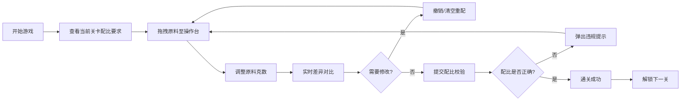

## 1. 产品概述
夏日冷饮原料配比闯关小游戏是一款互动式休闲游戏，玩家通过拖拽各种饮品原料（茶汤、牛奶、冰块、果糖、爆珠等）并调整克数，按照每关指定的标准配比完成冷饮调配。游戏旨在通过趣味化的方式让玩家体验饮品制作过程，同时锻炼玩家的精确配比能力。

## 2. 核心功能

### 2.1 功能模块
1. **游戏主界面**：关卡展示区、原料拖拽区、配比调配操作台、差异对比面板
2. **关卡系统**：多关卡递进式设计，每关有固定的标准配比
3. **拖拽操作**：原料素材拖拽到操作台、分量克数调整
4. **配比判定**：实时校验原料种类与分量是否匹配标准配比
5. **操作控制**：单步撤销操作、一键清空操作台
6. **反馈系统**：违规提示弹窗、通关成功动画、差异对比展示

### 2.2 页面详情
| 页面名称 | 模块名称 | 功能描述 |
|-----------|-------------|---------------------|
| 游戏主界面 | 关卡信息区 | 展示当前关卡编号、冷饮名称、通关状态 |
| 游戏主界面 | 标准配面板 | 显示目标冷饮的标准原料及对应克数 |
| 游戏主界面 | 原料素材区 | 可拖拽的各类饮品原料卡片（茶汤、牛奶、冰块、果糖、爆珠等） |
| 游戏主界面 | 调配操作台 | 玩家拖拽添加原料的区域，支持调整每种原料克数 |
| 游戏主界面 | 差异对比面板 | 实时对比当前配比与标准配比，标记偏差项 |
| 游戏主界面 | 操作控制区 | 撤销上一步、清空操作台、提交配比校验按钮 |
| 游戏主界面 | 弹窗反馈层 | 违规错误提示、通关成功提示、错误详情展示 |

## 3. 核心流程
玩家进入游戏 → 查看当前关卡冷饮标准配比 → 从原料区拖拽所需原料到操作台 → 调整每种原料的克数 → 实时查看与标准配比的差异 → 如需修改可撤销或清空 → 提交配比校验 → 系统判定（种类错误或分量偏差则弹出违规提示，全部达标则通关成功）→ 解锁下一关卡

## 4. 用户界面设计

### 4.1 设计风格
- **主色调**：清新夏日风格，以冰蓝色 (#4FC3F7) 和薄荷绿 (#81C784) 为主色调，搭配奶白色背景
- **辅助色**：暖橙色 (#FFB74D) 用于强调按钮，粉红色 (#F48FB1) 用于提示错误
- **按钮风格**：圆润胶囊状按钮，带有微立体阴影和悬停上浮效果
- **字体**：标题使用圆润可爱的展示字体，正文使用清晰易读的无衬线字体
- **布局风格**：卡片式布局，各区域划分清晰，操作台居中突出
- **图标风格**：使用 emoji 风格的可爱图标表现各类饮品原料

### 4.2 页面设计概述
| 页面名称 | 模块名称 | UI 元素 |
|-----------|-------------|-------------|
| 游戏主界面 | 关卡信息区 | 渐变背景色，大号关卡编号，冷饮名称卡片，进度指示 |
| 游戏主界面 | 原料素材区 | 横向滚动的原料卡片，每个卡片有图标、名称、单位，拖拽时半透明跟随效果 |
| 游戏主界面 | 调配操作台 | 大圆角容器，模拟调饮杯视觉效果，原料条目带数量调整器 (+/- 按钮) |
| 游戏主界面 | 差异对比面板 | 双栏表格对比，正确项绿色，错误项红色带差量提示，缺失项灰色标记 |
| 游戏主界面 | 操作控制区 | 三个主要按钮：撤销（灰色）、清空（警告色）、提交校验（主色强调） |
| 游戏主界面 | 弹窗反馈层 | 半透明遮罩，居中卡片，错误提示用红色系，成功提示用绿色系，带动画效果 |

### 4.3 响应式
采用桌面优先设计，确保在 1280px 及以上宽度获得最佳体验。操作台区域使用弹性布局适应不同屏幕，原料区支持横向滚动，保证在小屏设备上仍可完整操作。
