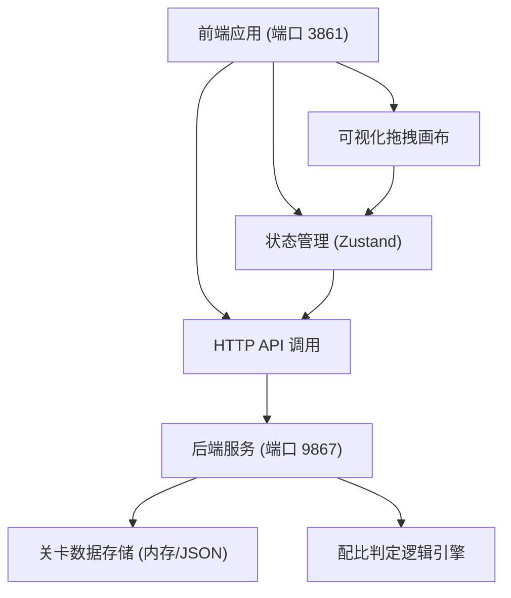
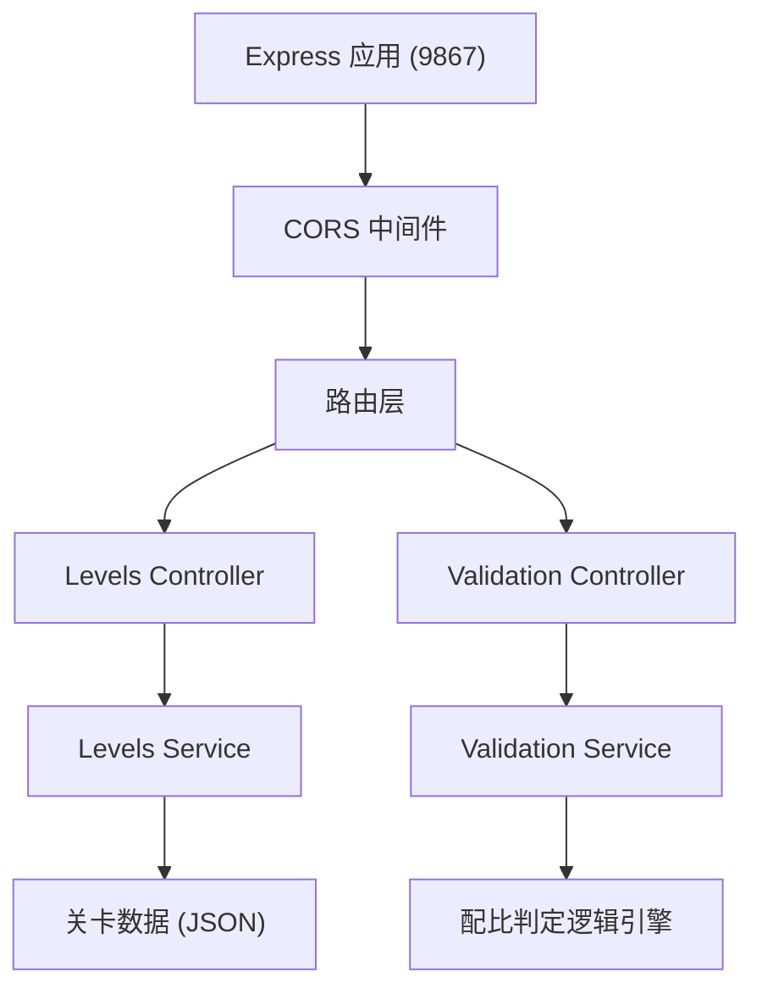
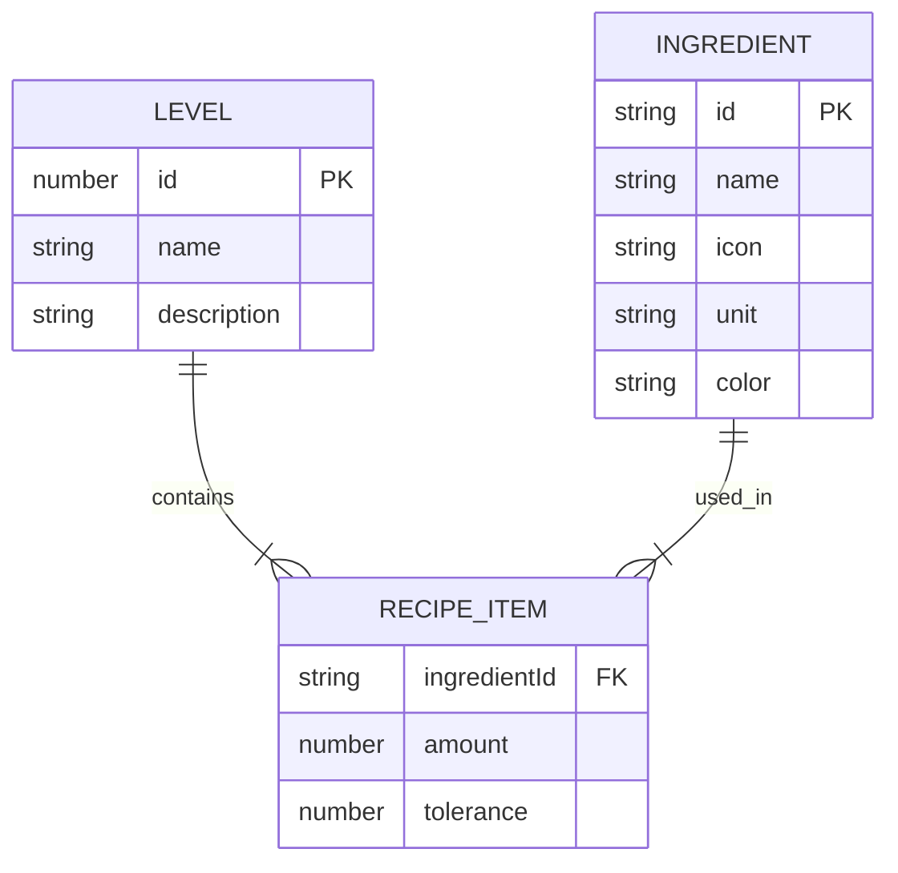

## 1. 架构设计



## 2. 技术描述
- **前端**：React@18 + TypeScript + TailwindCSS@3 + Vite + Zustand
- **初始化工具**：vite-init (react-express-ts 模板)
- **后端**：Express@4 + TypeScript
- **数据存储**：内存存储 + JSON 静态数据（无需数据库）
- **端口配置**：
  - 前端 Vite 开发服务器：3861
  - 后端 Express API 服务：9867

## 3. 路由定义

### 前端路由
| 路由 | 用途 |
|-------|---------|
| / | 游戏主界面 |

### 后端 API 路由
| 路由 | 方法 | 用途 |
|-------|------|---------|
| /api/levels | GET | 获取所有关卡列表 |
| /api/levels/:id | GET | 获取指定关卡的标准配比数据 |
| /api/validate | POST | 校验当前配比是否符合关卡标准 |

## 4. API 定义

### 类型定义
```typescript
// 原料类型
interface Ingredient {
  id: string;
  name: string;
  icon: string;
  unit: string;
  color: string;
}

// 关卡配比项
interface RecipeItem {
  ingredientId: string;
  amount: number;
  tolerance?: number; // 允许偏差克数，默认 0
}

// 关卡定义
interface Level {
  id: number;
  name: string;
  description: string;
  recipe: RecipeItem[];
}

// 玩家提交的配比
interface PlayerSubmission {
  levelId: number;
  items: { ingredientId: string; amount: number }[];
}

// 校验结果
interface ValidationResult {
  success: boolean;
  errors: ValidationError[];
  comparison: ComparisonItem[];
}

interface ValidationError {
  type: 'missing' | 'extra' | 'amount_mismatch';
  ingredientId?: string;
  ingredientName?: string;
  expected?: number;
  actual?: number;
  message: string;
}

interface ComparisonItem {
  ingredientId: string;
  ingredientName: string;
  expected: number | null;
  actual: number | null;
  status: 'correct' | 'missing' | 'extra' | 'incorrect';
  diff?: number;
}
```

### API 详细说明

#### GET /api/levels
获取所有关卡列表

**响应**:
```json
{
  "levels": [
    {
      "id": 1,
      "name": "经典珍珠奶茶",
      "description": "夏日最受欢迎的经典饮品",
      "recipe": [
        { "ingredientId": "tea", "amount": 150 },
        { "ingredientId": "milk", "amount": 100 },
        { "ingredientId": "ice", "amount": 80 },
        { "ingredientId": "sugar", "amount": 20 },
        { "ingredientId": "boba", "amount": 50 }
      ]
    }
  ]
}
```

#### GET /api/levels/:id
获取指定关卡详情

#### POST /api/validate
校验玩家配比

**请求体**:
```json
{
  "levelId": 1,
  "items": [
    { "ingredientId": "tea", "amount": 150 },
    { "ingredientId": "milk", "amount": 100 }
  ]
}
```

**响应**:
```json
{
  "success": false,
  "errors": [
    {
      "type": "missing",
      "ingredientId": "ice",
      "ingredientName": "冰块",
      "expected": 80,
      "message": "缺少原料：冰块 (80克)"
    }
  ],
  "comparison": [
    {
      "ingredientId": "tea",
      "ingredientName": "茶汤",
      "expected": 150,
      "actual": 150,
      "status": "correct"
    },
    {
      "ingredientId": "ice",
      "ingredientName": "冰块",
      "expected": 80,
      "actual": null,
      "status": "missing"
    }
  ]
}
```

## 5. 服务器架构图



## 6. 数据模型

### 6.1 数据模型定义



### 6.2 初始数据

```typescript
// 原料列表
const INGREDIENTS = [
  { id: 'tea', name: '茶汤', icon: '🍵', unit: '克', color: '#D4A574' },
  { id: 'milk', name: '牛奶', icon: '🥛', unit: '克', color: '#FFF8E7' },
  { id: 'ice', name: '冰块', icon: '🧊', unit: '克', color: '#B3E5FC' },
  { id: 'sugar', name: '果糖', icon: '🍯', unit: '克', color: '#FFE082' },
  { id: 'boba', name: '爆珠', icon: '⚫', unit: '克', color: '#5D4037' },
  { id: 'coconut', name: '椰奶', icon: '🥥', unit: '克', color: '#F5F5F5' },
  { id: 'mango', name: '芒果酱', icon: '🥭', unit: '克', color: '#FFB74D' },
  { id: 'strawberry', name: '草莓酱', icon: '🍓', unit: '克', color: '#EF9A9A' },
  { id: 'cream', name: '奶油', icon: '🍦', unit: '克', color: '#FFF3E0' },
  { id: 'coffee', name: '咖啡液', icon: '☕', unit: '克', color: '#6D4C41' },
];

// 关卡列表
const LEVELS = [
  {
    id: 1,
    name: '经典珍珠奶茶',
    description: '入门关卡，调配一杯标准的珍珠奶茶',
    recipe: [
      { ingredientId: 'tea', amount: 150 },
      { ingredientId: 'milk', amount: 100 },
      { ingredientId: 'ice', amount: 80 },
      { ingredientId: 'sugar', amount: 20 },
      { ingredientId: 'boba', amount: 50 },
    ],
  },
  {
    id: 2,
    name: '冰镇柠檬茶',
    description: '清爽解腻的柠檬茶，少糖多冰',
    recipe: [
      { ingredientId: 'tea', amount: 200 },
      { ingredientId: 'ice', amount: 120 },
      { ingredientId: 'sugar', amount: 15 },
    ],
  },
  {
    id: 3,
    name: '椰香芒果冰',
    description: '热带风情的芒果特调',
    recipe: [
      { ingredientId: 'coconut', amount: 150 },
      { ingredientId: 'mango', amount: 80 },
      { ingredientId: 'ice', amount: 100 },
      { ingredientId: 'cream', amount: 30 },
    ],
  },
  {
    id: 4,
    name: '草莓生椰乳',
    description: '少女心满满的草莓特调',
    recipe: [
      { ingredientId: 'coconut', amount: 180 },
      { ingredientId: 'strawberry', amount: 60 },
      { ingredientId: 'ice', amount: 90 },
      { ingredientId: 'sugar', amount: 10 },
      { ingredientId: 'cream', amount: 20 },
    ],
  },
  {
    id: 5,
    name: '鸳鸯奶茶',
    description: '咖啡与奶茶的完美融合',
    recipe: [
      { ingredientId: 'tea', amount: 100 },
      { ingredientId: 'coffee', amount: 80 },
      { ingredientId: 'milk', amount: 120 },
      { ingredientId: 'ice', amount: 70 },
      { ingredientId: 'sugar', amount: 25 },
    ],
  },
];
```
